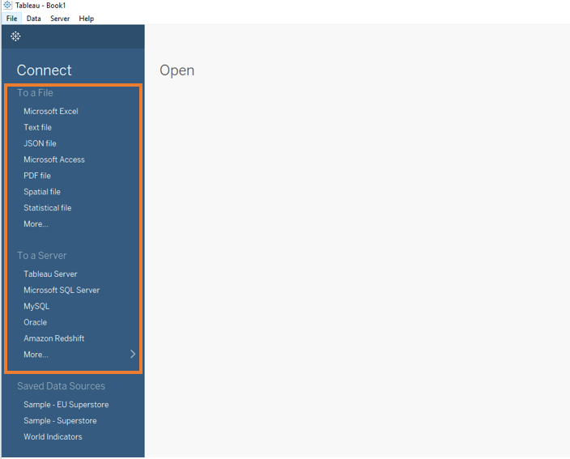

# I. Connecting to a Data Source

Tableau is compatible with difference data sources.

The following features will be covered in this section.

- Data predview
- Metadata view
- Filter data
- Joining table

## Demo 1

We will be working on a sample Excel data data in this tutorial. For more information about data connectors in Tableau, please visit this [guide](<https://help.tableau.com/current/pro/desktop/en-us/datasource_prepare.htm>).

- Click [here](sample_data/sample_1_superstore.xls) to download the data ([source](<https://community.tableau.com/docs/DOC-1236>))
- Select `Microsoft Excel` and open the downloaded file

- The list of worksheets is displayed under the `Sheets`.

- You can take a quick look at each sheet.

- To import a sheet, do a simple drag and drop. You will be able to preview the data and the metadata (the list of fields).

  

  

  ## Demo 2

  - **Data Preview**

  

  

  - **Metadata View**
  
  

## Demo 3

- To filter the data, select `Edit Data Source Filters...` from `Data` - Click on`Add..` to select a field to filter - Choose what to exclude or to include - Click on `Ok` to apply the data filter. You can add more than one data filters. 

For complex filtering, try out `Wildcard`, `Condition`, and `Top` features. 

## Demo 4

You can join multiple sheets easily in Tableau. Drag another sheet and explore different ways of table joining.

- **Inner**: Include values that have matches in both tables only
- **Left**: Include all values from the left table and corresponding matches from the right table
- **Right**: Include all values from the right table and corresponding matches from the left table
- **Full Outer**: Include all values from both tables

##Demo 5

There is another feature called union in Tableau which allow you to join the rows.

- Click on `New Union` - Drag the tables you want to union into the box - OK

