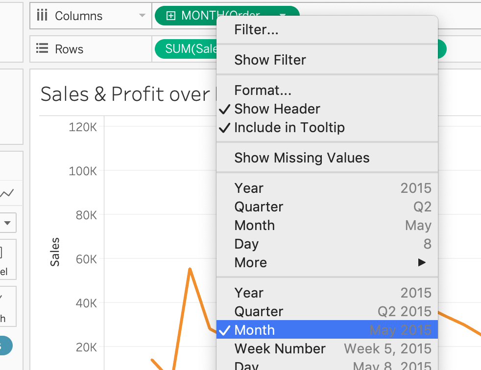

# II. Create a Simple Chart

In this section, we will create a simple bar chart using the data from the sheet `Orders`.

The sample workbook is available [here](tableau_workbooks/p2.twb).

## Tableau Concepts

- **Dimensions**: Qualitative fields that can be used to categorize, e.g., cities, dates, names
- **Measures**:  Fields that contain measurable numeric/quantitative values
- **Aggregation**: Summarize the data, e.g., SUM, Mean.
  - Useful resources:
    - [Data Aggregation in Tableau, Tableau Website](https://help.tableau.com/current/pro/desktop/en-us/calculations_aggregation.htm)
    - [Aggregate Functions in Tableau, Tableau Website](https://help.tableau.com/current/pro/desktop/en-us/calculations_calculatedfields_aggregate_create.htm)

## Demo 1. A simple bar chart

### Question

Which is the month that has the largest sales volume on average based on 3 years of order data?

### Tips

- You will be using the `order` data

- Identify key concepts from the question

  - **Dimensions**: month
  - **Measures**: sales volume

- Locate the relavant fields from the list

  - **Month**: extract from the field `Order Date`
  - **Sales volume**: `Sales`

- Consider whether any data aggregation is needed

  - **Sales volume**: **Average** of `Sales` in each month over years

- A **bar chart** is simple and good for comparing purposes.

  

### Steps

1. After you import the data, click on `Sheet 1` at the bottom to create a new sheet. You will see all the fields are listed under the `Data` pane
   -  You should see all the fields are listed under the `Data` pane

2. Give your worksheet a name

3. Drag the fields to the view
   - X-axis: `Order Date`
   
   - Y-axis: `Sales`
   
     

4. Adjust the granuality of the dimension

   - Change the `Year(Order Date)` to `Month(Order Date)\. For more information about **Dates** in Tableau, you can refer to the [documentation](https://help.tableau.com/current/pro/desktop/en-us/functions_functions_date.htm) on the Tableau Website.
   - Tableau auto suggested `SUM` as the way of **aggregation**. To change the aggregation, simply click on the field name in **Rows** - From `Measure` select the `Average`.

5. Select the type of chart

6. Add labels

7. Edit the tooltip

## Demo 2. A stacked bar chart

### Question

On top of the previous quesiton, you would like to also take a look at the distribution of products in different categories.

### Tips
- A stacked bar chart will serve this need.
- Add the dimension as **Color**

### Steps
1. Create a copy of `Sales_by_Month`

2. Rename the sheet and the chart

3. Drag `Category` to **Color**
  

## Demo 3. A dual line chart

### Question

What was the trend of sales and profits over months?

### Tips

- You will be using the `order` data
- Identify key concepts from the question

  - **Dimensions**: month year (e.g., May 2014)
  - **Measures**: sales volume & profit
- Locate the relavant fields from the list

  - **Month**: extract from the field `Order Date`
  - **Sales volume**: `Sales` & `profit`
- Consider whether any data aggregation is needed

  - **Sales volume**: **Sum** of `Sales` in each month
- A **line chart** is simple and good for showing the trends

### Steps

1. Create a new sheet - Name both the sheet and the chart

   

2. Drag the fields to the view

   - X-axis: `Order Date`
   - Y-axis: `Sales`; `Profit`

   

3. Adjust the granuality of the dimension

   - Change the `Year(Order Date)` to `Month(Order Date)`.
   - The aggregation is set to **SUM** by default.

4. Line charts are automatically suggested. 

5. To change to dual axis, right click any of the meausre, select `Dual Axis`

7. Prefer an area chart?

- Synchronize the axis the make the lines comparable.

- Go to **Marks** - Under the chart selection dropdown, select `Area`

