# IV. Tableau Dashboard

Tableau dashboard is a consolidated display of multiple worksheets.

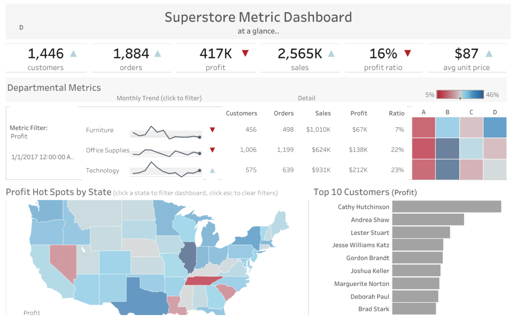

Image source: [Superstore Metric Dashboard, Jon Dugger, Tableau Public Gallery](https://public.tableau.com/profile/jodugg3205#!/vizhome/SuperstoreDashboard_14/SSDashboard)

## Best Practices for Effective Dashboards

- Extract and work with a subset of your data
- Leverage the most-viewed spot (usually the upper-left corner)
- Limit the number of views to avoid information overload
- Add interactivity
  - Show filters
  - Enable highlighting

Source: [Best Practices for Effective Dashboards, Tableau Website]( https://help.tableau.com/current/pro/desktop/en-us/dashboards_best_practices.htm)

## An example of Tableau Dashboard

- Go to this [website](https://public.tableau.com/profile/amarendrad#!/vizhome/CrimesinIndiaunderIndianPenalCodeIPC-2014/CrimesinIndia), to download the dashboard **Crimes in India**

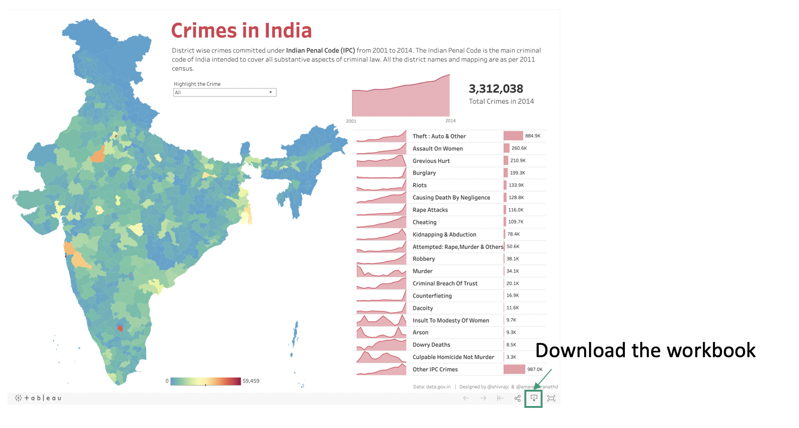

- Open the workbook in Tableau - Go to the dashboard
  - How many sheets are there in the dashboard?
  - What kind of interactivity is available in this dashboard?

## Demo 1 - Add a filter

In this demo, we will

- Add an interactive fitler to the sample bar chart
- Create a new dashboard
- Apply the filter multiple charts, including the sample bar chart and the map

### Steps

1. Decide on the dimension to filter. In this example, we use the field  `Category`

   

2. Drag the `Category`  to **Filters** - Keep the default setting to include all data and click on **OK**

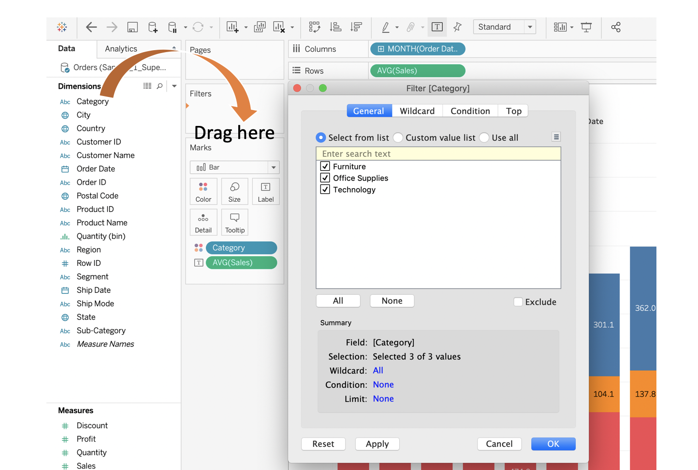

3. To activate the interactive filter, click on the `Category` under the **Filters**, select **Show Filter**
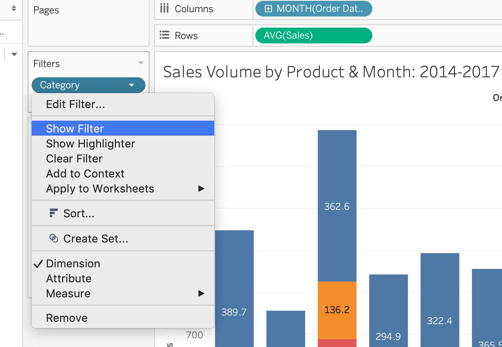

4. You should see the filter next to the visualisation. You can check/uncheck the boxes next to the category and observe the changes on bar chart.

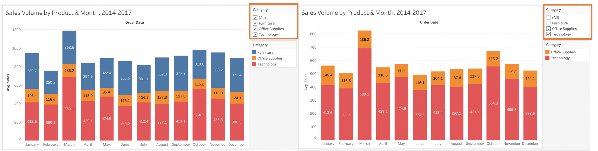

5. Tableau allows you to change the look & feel and the control of the filter.

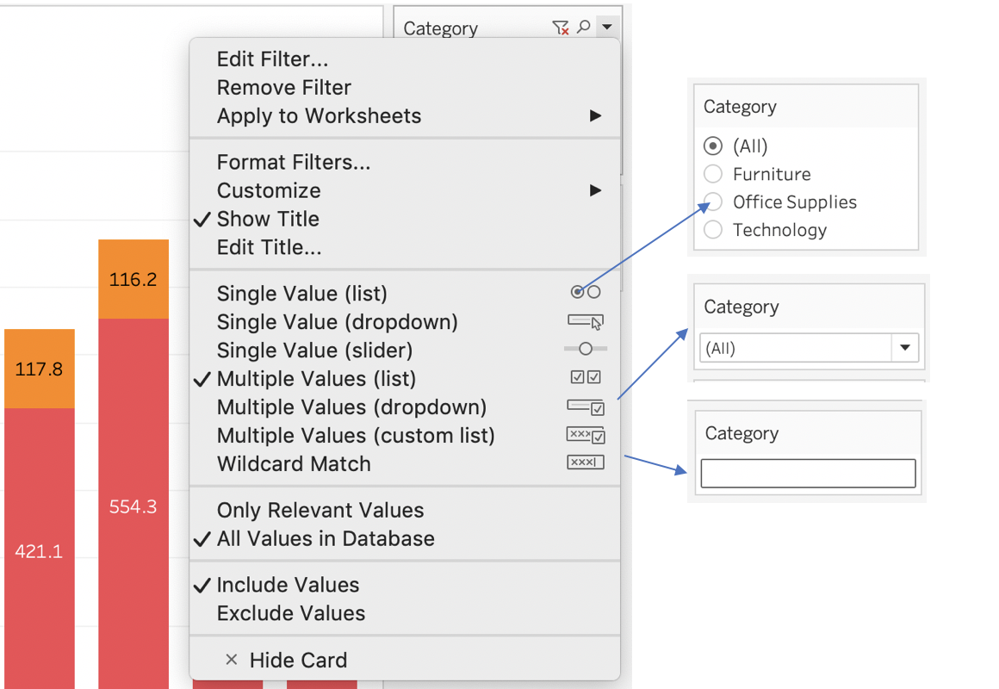

6. To create a dashboard, click on the **New Dashboard** button at the bottom of the window.

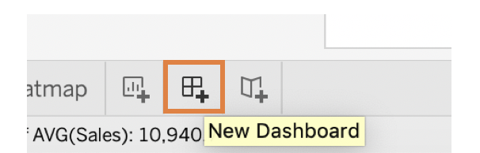

7. To add visualisations, simply drag them from **Sheets** to the dashboard.

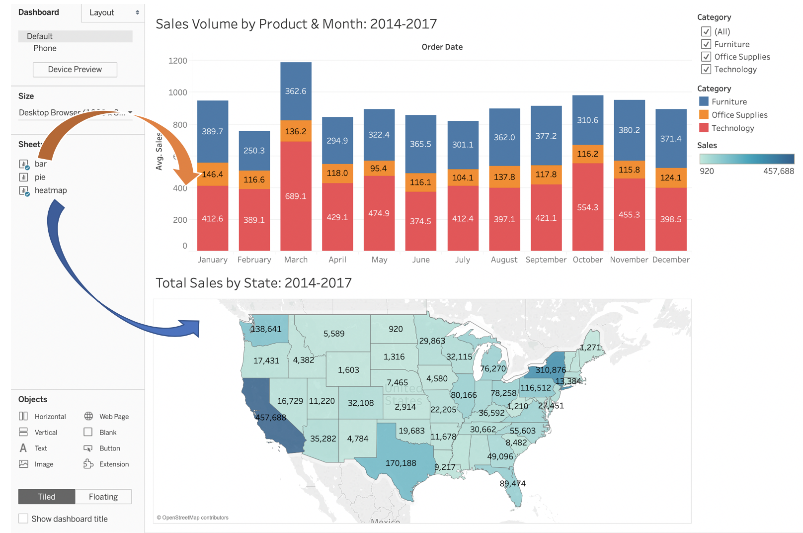

7. To apply the filter to the map on the same dashboard, you can click on the arrow on the filter box - - - Select **Apply to Worksheets** - Select **Selected Worksheets** - Check the box next to `heatmap` or click on **All on dashboard** - Click **OK**
   - Alternatively you can say **All using related data sources** or **All using this data source** because both conditions apply to the bar chart and the heatmap selected.

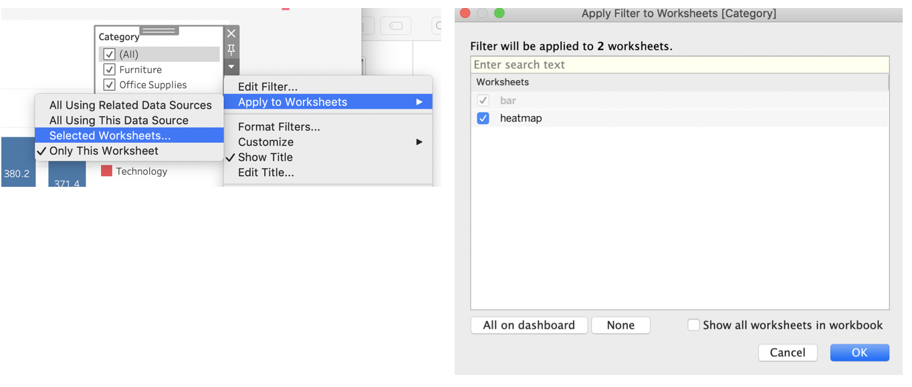

8. You should now find the filter can control both visualisations at the same time.

### Relevant Resources

- [Filter Data from Your Views, Tableau Website](https://help.tableau.com/current/pro/desktop/en-us/filtering.htm)

- [Apply Filters to Multiple Worksheets, Tableau Website](https://help.tableau.com/current/pro/desktop/en-us/filtering_global.htm)

  

## Demo 2 - Use a chart as a filter

In this example, we will use a pie chart as a filter to control the visualisation of another sample chart.

### Steps

1. Create a copy of the dashboard in the last demo - Drag the pie chart to the dashboard - Remove the container of the legends
  

  

2. Click on the arrow on the box of the pie chart, select **Use as Filter**
  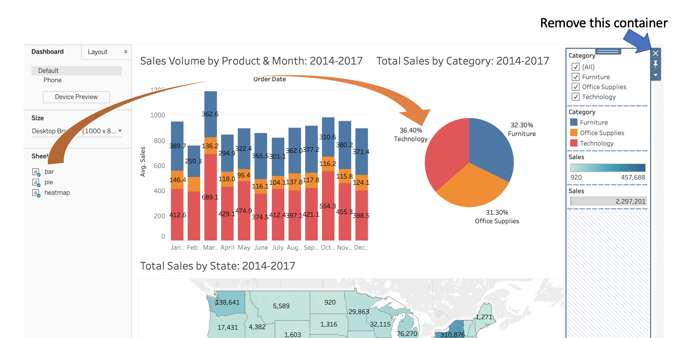

  

3. Click on any pie in the pie chart should filter the data in the bar chart and the map
  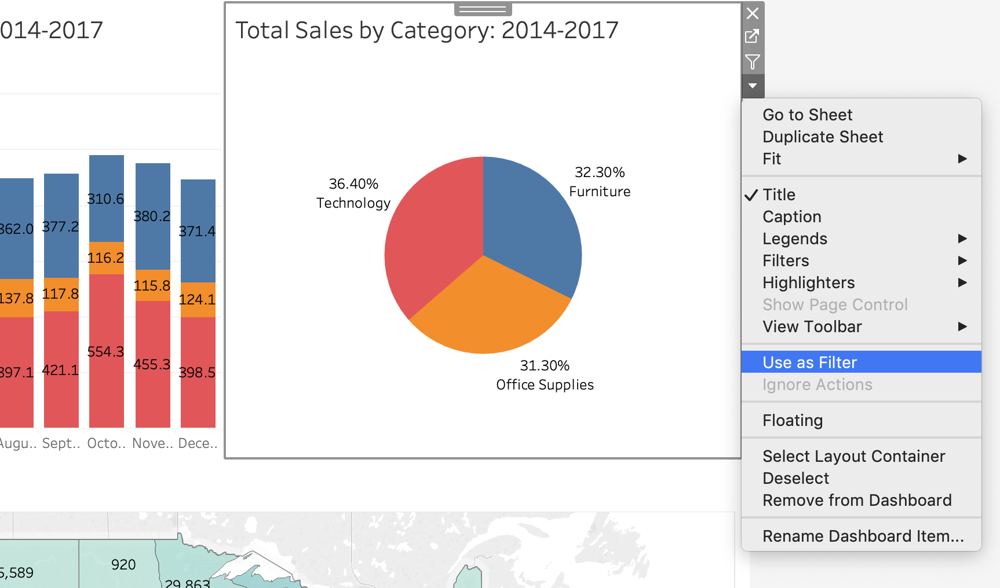

### Relevant Resources

- [Tableau 201: 3 Creative Ways to Use Dashboard Actions](https://evolytics.com/blog/tableau-201-3-creative-ways-to-use-dashboard-actions/)

  

## Demo 3 - Add data point highlighter

In this demo, we will add a data point highlighter to the sample line chart. The sample line charts plots the average sales volume by month and the product sub-category. The data point highlighter created will highlight the correpsonding line on the chart when a sub-category is given.

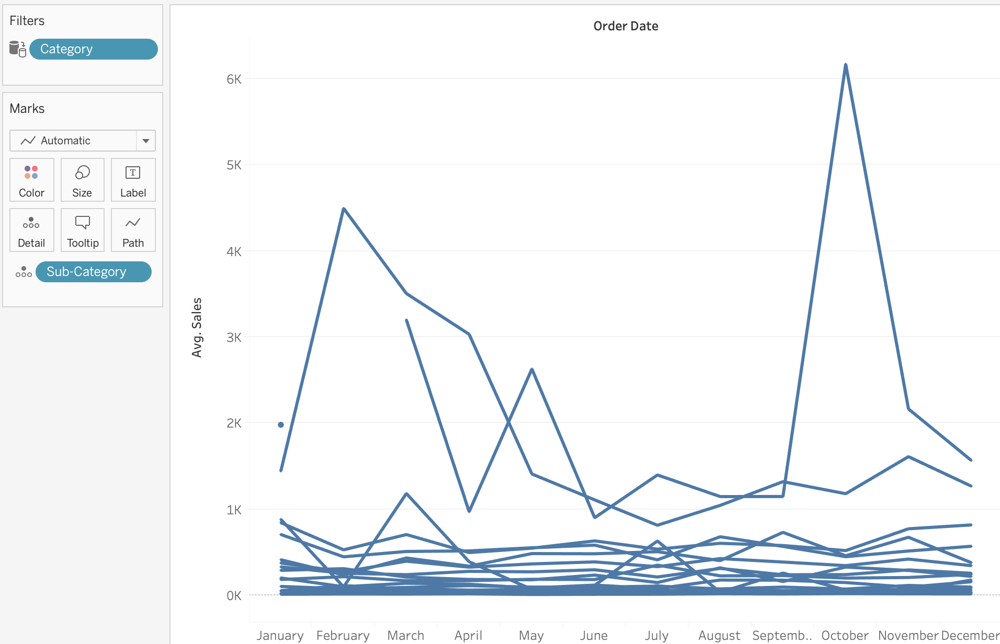

### Steps

1. Go to the filed `Sub-Category` under **Marks** - Select the option **Show Highlighter**

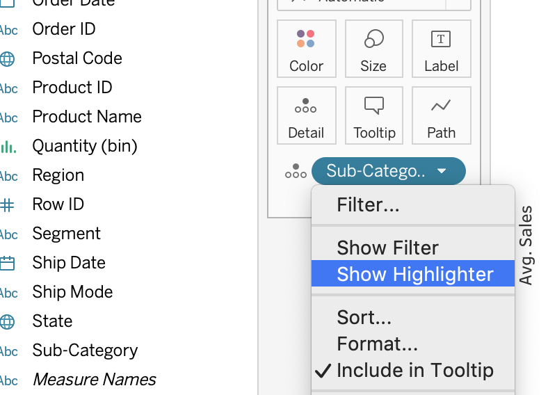

2. A data point highlighter should be added to the right of the chart. Select any option from the dropdown should lead to corresponding highlight of line on the chart.

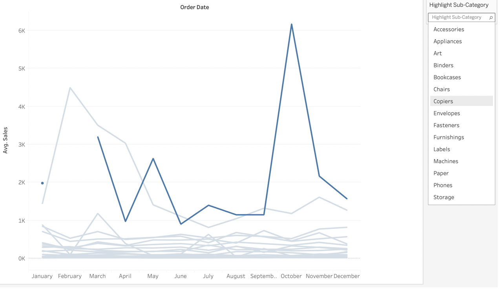

### Relevant Resources

- [Highlight Data Points in Context](https://help.tableau.com/current/pro/desktop/en-us/actions_highlight_highlighter.htm)

